# Berechtigungen verwalten

Kontrollieren Sie die Tool-Nutzung und Berechtigungen im Claude Agent SDK

---

# SDK-Berechtigungen

Das Claude Agent SDK bietet leistungsstarke Berechtigungskontrollen, mit denen Sie verwalten können, wie Claude Tools in Ihrer Anwendung verwendet. 

Dieser Leitfaden behandelt die Implementierung von Berechtigungssystemen mit dem `canUseTool`-Callback, Hooks und settings.json-Berechtigungsregeln. Für die vollständige API-Dokumentation siehe die [TypeScript SDK-Referenz](https://code.claude.com/docs/typescript-sdk-reference).

## Überblick

Das Claude Agent SDK bietet vier ergänzende Möglichkeiten zur Kontrolle der Tool-Nutzung:

1. **[Berechtigungsmodi](#berechtigungsmodi)** - Globale Berechtigungsverhalten-Einstellungen, die alle Tools betreffen
2. **[canUseTool-Callback](https://code.claude.com/docs/typescript-sdk-reference#canusetool)** - Laufzeit-Berechtigungshandler für Fälle, die nicht von anderen Regeln abgedeckt werden
3. **[Hooks](https://code.claude.com/docs/typescript-sdk-reference#hook-types)** - Feinabstimmung der Kontrolle über jede Tool-Ausführung mit benutzerdefinierter Logik
4. **[Berechtigungsregeln (settings.json)](https://code.claude.com/docs/settings#permission-settings)** - Deklarative Erlauben/Verweigern-Regeln mit integrierter Bash-Befehl-Analyse

Anwendungsfälle für jeden Ansatz:
- Berechtigungsmodi - Gesamtverhalten der Berechtigungen festlegen (Planung, automatisches Akzeptieren von Bearbeitungen, Umgehung von Prüfungen)
- `canUseTool` - Dynamische Genehmigung für nicht abgedeckte Fälle, fordert Benutzer zur Berechtigung auf
- Hooks - Programmatische Kontrolle über alle Tool-Ausführungen
- Berechtigungsregeln - Statische Richtlinien mit intelligenter Bash-Befehl-Analyse

## Berechtigungsfluss-Diagramm

```mermaid
flowchart TD
    Start([Tool-Anfrage]) --> PreHook(PreToolUse Hook)

    PreHook -->|&nbsp;&nbsp;Erlauben&nbsp;&nbsp;| Execute(Tool ausführen)
    PreHook -->|&nbsp;&nbsp;Verweigern&nbsp;&nbsp;| Denied(Verweigert)
    PreHook -->|&nbsp;&nbsp;Fragen&nbsp;&nbsp;| Callback(canUseTool Callback)
    PreHook -->|&nbsp;&nbsp;Fortfahren&nbsp;&nbsp;| Deny(Verweigerungs-Regeln prüfen)

    Deny -->|&nbsp;&nbsp;Übereinstimmung&nbsp;&nbsp;| Denied
    Deny -->|&nbsp;&nbsp;Keine Übereinstimmung&nbsp;&nbsp;| Allow(Erlaubnis-Regeln prüfen)

    Allow -->|&nbsp;&nbsp;Übereinstimmung&nbsp;&nbsp;| Execute
    Allow -->|&nbsp;&nbsp;Keine Übereinstimmung&nbsp;&nbsp;| Ask(Frage-Regeln prüfen)

    Ask -->|&nbsp;&nbsp;Übereinstimmung&nbsp;&nbsp;| Callback
    Ask -->|&nbsp;&nbsp;Keine Übereinstimmung&nbsp;&nbsp;| Mode{Berechtigungsmodus?}

    Mode -->|&nbsp;&nbsp;bypassPermissions&nbsp;&nbsp;| Execute
    Mode -->|&nbsp;&nbsp;Andere Modi&nbsp;&nbsp;| Callback

    Callback -->|&nbsp;&nbsp;Erlauben&nbsp;&nbsp;| Execute
    Callback -->|&nbsp;&nbsp;Verweigern&nbsp;&nbsp;| Denied

    Denied --> DeniedResponse([Rückmeldung an Agent])

    Execute --> PostHook(PostToolUse Hook)
    PostHook --> Done([Tool-Antwort])






```



**Verarbeitungsreihenfolge:** PreToolUse Hook → Verweigerungs-Regeln → Erlaubnis-Regeln → Frage-Regeln → Berechtigungsmodus-Prüfung → canUseTool Callback → PostToolUse Hook

## Berechtigungsmodi

Berechtigungsmodi bieten globale Kontrolle darüber, wie Claude Tools verwendet. Sie können den Berechtigungsmodus beim Aufruf von `query()` festlegen oder ihn während Streaming-Sitzungen dynamisch ändern.

### Verfügbare Modi

Das SDK unterstützt vier Berechtigungsmodi, jeder mit unterschiedlichem Verhalten:

| Modus | Beschreibung | Tool-Verhalten |
| :--- | :--- | :--- |
| `default` | Standard-Berechtigungsverhalten | Normale Berechtigungsprüfungen gelten |
| `plan` | Planungsmodus - keine Ausführung | Claude kann nur schreibgeschützte Tools verwenden; präsentiert einen Plan vor der Ausführung |
| `acceptEdits` | Datei-Bearbeitungen automatisch akzeptieren | Datei-Bearbeitungen und Dateisystem-Operationen werden automatisch genehmigt |
| `bypassPermissions` | Alle Berechtigungsprüfungen umgehen | Alle Tools laufen ohne Berechtigungsaufforderungen (mit Vorsicht verwenden) |

### Berechtigungsmodus festlegen

Sie können den Berechtigungsmodus auf zwei Arten festlegen:

#### 1. Anfangskonfiguration

Legen Sie den Modus beim Erstellen einer Abfrage fest:

<CodeGroup>

```typescript TypeScript
import { query } from "@anthropic-ai/claude-agent-sdk";

const result = await query({
  prompt: "Hilf mir, diesen Code zu refaktorieren",
  options: {
    permissionMode: 'default'  // Standard-Berechtigungsmodus
  }
});
```

```python Python
from claude_agent_sdk import query

result = await query(
    prompt="Hilf mir, diesen Code zu refaktorieren",
    options={
        "permission_mode": "default"  # Standard-Berechtigungsmodus
    }
)
```

</CodeGroup>

#### 2. Dynamische Modusänderungen (nur Streaming)

Ändern Sie den Modus während einer Streaming-Sitzung:

<CodeGroup>

```typescript TypeScript
import { query } from "@anthropic-ai/claude-agent-sdk";

// Erstellen Sie einen asynchronen Generator für Streaming-Eingabe
async function* streamInput() {
  yield { 
    type: 'user',
    message: { 
      role: 'user', 
      content: "Lass uns mit Standard-Berechtigungen beginnen" 
    }
  };
  
  // Später im Gespräch...
  yield {
    type: 'user',
    message: {
      role: 'user',
      content: "Jetzt lass uns die Entwicklung beschleunigen"
    }
  };
}

const q = query({
  prompt: streamInput(),
  options: {
    permissionMode: 'default'  // Im Standard-Modus beginnen
  }
});

// Modus dynamisch ändern
await q.setPermissionMode('acceptEdits');

// Nachrichten verarbeiten
for await (const message of q) {
  console.log(message);
}
```

```python Python
from claude_agent_sdk import query

async def stream_input():
    """Asynchroner Generator für Streaming-Eingabe"""
    yield {
        "type": "user",
        "message": {
            "role": "user",
            "content": "Lass uns mit Standard-Berechtigungen beginnen"
        }
    }
    
    # Später im Gespräch...
    yield {
        "type": "user",
        "message": {
            "role": "user",
            "content": "Jetzt lass uns die Entwicklung beschleunigen"
        }
    }

q = query(
    prompt=stream_input(),
    options={
        "permission_mode": "default"  # Im Standard-Modus beginnen
    }
)

# Modus dynamisch ändern
await q.set_permission_mode("acceptEdits")

# Nachrichten verarbeiten
async for message in q:
    print(message)
```

</CodeGroup>

### Modus-spezifische Verhaltensweisen

#### Bearbeitungen akzeptieren-Modus (`acceptEdits`)

Im Bearbeitungen akzeptieren-Modus:
- Alle Datei-Bearbeitungen werden automatisch genehmigt
- Dateisystem-Operationen (mkdir, touch, rm, etc.) werden automatisch genehmigt
- Andere Tools erfordern noch normale Berechtigungen
- Beschleunigt die Entwicklung, wenn Sie Claudes Bearbeitungen vertrauen
- Nützlich für schnelle Prototypenerstellung und Iterationen

Automatisch genehmigte Operationen:
- Datei-Bearbeitungen (Edit, Write Tools)
- Bash-Dateisystem-Befehle (mkdir, touch, rm, mv, cp)
- Dateierstellung und -löschung

#### Berechtigungen umgehen-Modus (`bypassPermissions`)

Im Berechtigungen umgehen-Modus:
- **ALLE Tool-Verwendungen werden automatisch genehmigt**
- Keine Berechtigungsaufforderungen erscheinen
- Hooks werden noch ausgeführt (können Operationen noch blockieren)
- **Mit äußerster Vorsicht verwenden** - Claude hat vollen Systemzugriff
- Nur für kontrollierte Umgebungen empfohlen

### Modus-Priorität im Berechtigungsfluss

Berechtigungsmodi werden an einem bestimmten Punkt im Berechtigungsfluss bewertet:

1. **Hooks werden zuerst ausgeführt** - Können erlauben, verweigern, fragen oder fortfahren
2. **Verweigerungs-Regeln** werden geprüft - Blockieren Tools unabhängig vom Modus
3. **Erlaubnis-Regeln** werden geprüft - Erlauben Tools bei Übereinstimmung
4. **Frage-Regeln** werden geprüft - Fordern Berechtigung bei Übereinstimmung
5. **Berechtigungsmodus** wird bewertet:
   - **`bypassPermissions`-Modus** - Wenn aktiv, erlaubt alle verbleibenden Tools
   - **Andere Modi** - Übertragen an `canUseTool`-Callback
6. **`canUseTool`-Callback** - Behandelt verbleibende Fälle

Das bedeutet:
- Hooks können die Tool-Verwendung immer kontrollieren, auch im `bypassPermissions`-Modus
- Explizite Verweigerungs-Regeln überschreiben alle Berechtigungsmodi
- Frage-Regeln werden vor Berechtigungsmodi bewertet
- `bypassPermissions`-Modus überschreibt den `canUseTool`-Callback für nicht übereinstimmende Tools

### Bewährte Praktiken

1. **Verwenden Sie den Standard-Modus** für kontrollierte Ausführung mit normalen Berechtigungsprüfungen
2. **Verwenden Sie acceptEdits-Modus** beim Arbeiten an isolierten Dateien oder Verzeichnissen
3. **Vermeiden Sie bypassPermissions** in der Produktion oder auf Systemen mit sensiblen Daten
4. **Kombinieren Sie Modi mit Hooks** für feinabgestimmte Kontrolle
5. **Wechseln Sie Modi dynamisch** basierend auf Aufgabenfortschritt und Vertrauen

Beispiel für Modus-Progression:
```typescript
// Im Standard-Modus für kontrollierte Ausführung beginnen
permissionMode: 'default'

// Zu acceptEdits für schnelle Iteration wechseln
await q.setPermissionMode('acceptEdits')
```

## canUseTool

Der `canUseTool`-Callback wird als Option beim Aufruf der `query`-Funktion übergeben. Er erhält den Tool-Namen und Eingabeparameter und muss eine Entscheidung zurückgeben - entweder erlauben oder verweigern.

canUseTool wird ausgelöst, wann immer Claude Code eine Berechtigungsaufforderung an einen Benutzer zeigen würde, z.B. Hooks und Berechtigungsregeln decken es nicht ab und es ist nicht im acceptEdits-Modus.

Hier ist ein vollständiges Beispiel, das zeigt, wie interaktive Tool-Genehmigung implementiert wird:

<CodeGroup>

```typescript TypeScript
import { query } from "@anthropic-ai/claude-agent-sdk";

async function promptForToolApproval(toolName: string, input: any) {
  console.log("\n🔧 Tool-Anfrage:");
  console.log(`   Tool: ${toolName}`);
  
  // Tool-Parameter anzeigen
  if (input && Object.keys(input).length > 0) {
    console.log("   Parameter:");
    for (const [key, value] of Object.entries(input)) {
      let displayValue = value;
      if (typeof value === 'string' && value.length > 100) {
        displayValue = value.substring(0, 100) + "...";
      } else if (typeof value === 'object') {
        displayValue = JSON.stringify(value, null, 2);
      }
      console.log(`     ${key}: ${displayValue}`);
    }
  }
  
  // Benutzer-Genehmigung einholen (ersetzen Sie durch Ihre UI-Logik)
  const approved = await getUserApproval();
  
  if (approved) {
    console.log("   ✅ Genehmigt\n");
    return {
      behavior: "allow",
      updatedInput: input
    };
  } else {
    console.log("   ❌ Verweigert\n");
    return {
      behavior: "deny",
      message: "Benutzer hat die Berechtigung für dieses Tool verweigert"
    };
  }
}

// Den Berechtigungs-Callback verwenden
const result = await query({
  prompt: "Hilf mir, diese Codebasis zu analysieren",
  options: {
    canUseTool: async (toolName, input) => {
      return promptForToolApproval(toolName, input);
    }
  }
});
```

```python Python
from claude_agent_sdk import query

async def prompt_for_tool_approval(tool_name: str, input_params: dict):
    print(f"\n🔧 Tool-Anfrage:")
    print(f"   Tool: {tool_name}")

    # Parameter anzeigen
    if input_params:
        print("   Parameter:")
        for key, value in input_params.items():
            display_value = value
            if isinstance(value, str) and len(value) > 100:
                display_value = value[:100] + "..."
            elif isinstance(value, (dict, list)):
                display_value = json.dumps(value, indent=2)
            print(f"     {key}: {display_value}")

    # Benutzer-Genehmigung einholen
    answer = input("\n   Diese Tool-Verwendung genehmigen? (j/n): ")

    if answer.lower() in ['j', 'ja']:
        print("   ✅ Genehmigt\n")
        return {
            "behavior": "allow",
            "updatedInput": input_params
        }
    else:
        print("   ❌ Verweigert\n")
        return {
            "behavior": "deny",
            "message": "Benutzer hat die Berechtigung für dieses Tool verweigert"
        }

# Den Berechtigungs-Callback verwenden
result = await query(
    prompt="Hilf mir, diese Codebasis zu analysieren",
    options={
        "can_use_tool": prompt_for_tool_approval
    }
)
```

</CodeGroup>

## Verwandte Ressourcen

- [Hooks-Leitfaden](https://code.claude.com/docs/hooks-guide) - Lernen Sie, wie Sie Hooks für feinabgestimmte Kontrolle über Tool-Ausführung implementieren
- [Einstellungen: Berechtigungsregeln](https://code.claude.com/docs/settings#permission-settings) - Konfigurieren Sie deklarative Erlauben/Verweigern-Regeln mit Bash-Befehl-Analyse
