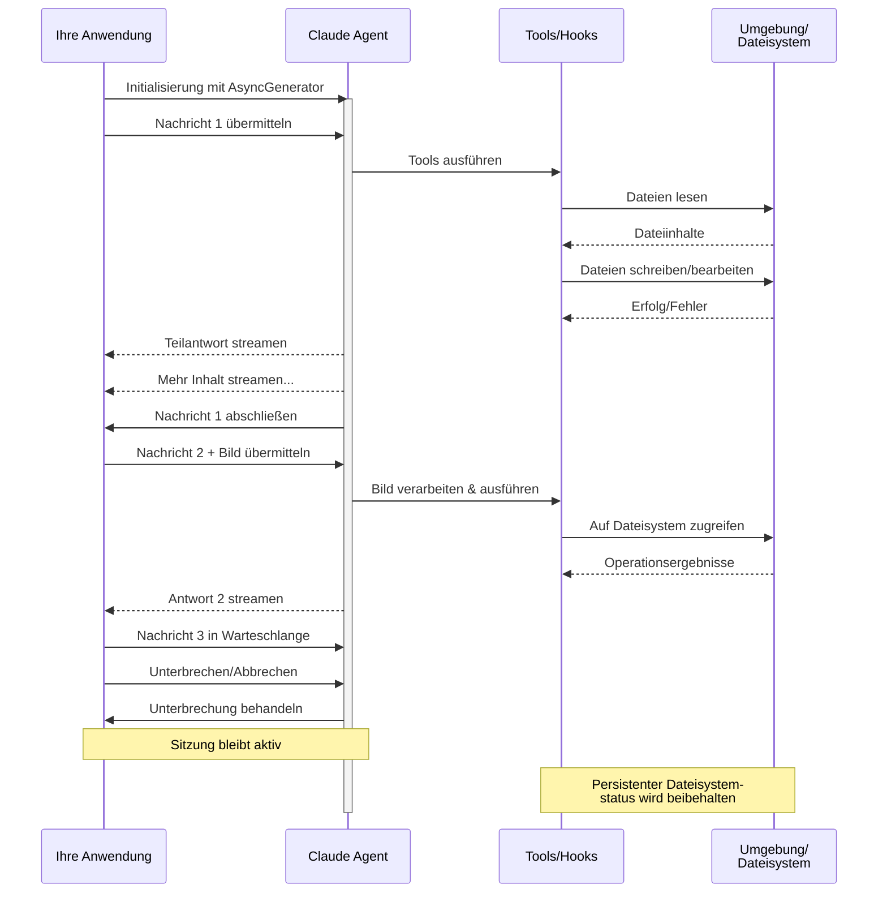

# Streaming-Eingabe

Verstehen der zwei Eingabemodi für das Claude Agent SDK und wann jeder verwendet werden sollte

---

## Überblick

Das Claude Agent SDK unterstützt zwei verschiedene Eingabemodi für die Interaktion mit Agenten:

- **Streaming-Eingabemodus** (Standard & Empfohlen) - Eine persistente, interaktive Sitzung
- **Einzelnachrichten-Eingabe** - Einmalige Abfragen, die Sitzungsstatus und Wiederaufnahme verwenden

Dieser Leitfaden erklärt die Unterschiede, Vorteile und Anwendungsfälle für jeden Modus, um Ihnen bei der Auswahl des richtigen Ansatzes für Ihre Anwendung zu helfen.

## Streaming-Eingabemodus (Empfohlen)

Der Streaming-Eingabemodus ist die **bevorzugte** Art, das Claude Agent SDK zu verwenden. Er bietet vollen Zugang zu den Fähigkeiten des Agenten und ermöglicht reichhaltige, interaktive Erfahrungen.

Er ermöglicht es dem Agenten, als langlebiger Prozess zu operieren, der Benutzereingaben entgegennimmt, Unterbrechungen behandelt, Berechtigungsanfragen anzeigt und Sitzungsverwaltung übernimmt.

### Wie es funktioniert



### Vorteile

<CardGroup cols={2}>
  <Card title="Bild-Uploads" icon="image">
    Bilder direkt an Nachrichten anhängen für visuelle Analyse und Verständnis
  </Card>
  <Card title="Nachrichten in Warteschlange" icon="stack">
    Mehrere Nachrichten senden, die sequenziell verarbeitet werden, mit der Möglichkeit zu unterbrechen
  </Card>
  <Card title="Tool-Integration" icon="wrench">
    Vollzugriff auf alle Tools und benutzerdefinierte MCP-Server während der Sitzung
  </Card>
  <Card title="Hooks-Unterstützung" icon="link">
    Lebenszyklus-Hooks verwenden, um Verhalten an verschiedenen Punkten anzupassen
  </Card>
  <Card title="Echtzeit-Feedback" icon="lightning">
    Antworten sehen, während sie generiert werden, nicht nur Endergebnisse
  </Card>
  <Card title="Kontext-Persistenz" icon="database">
    Gesprächskontext über mehrere Wendungen natürlich beibehalten
  </Card>
</CardGroup>

### Implementierungsbeispiel

<CodeGroup>

```typescript TypeScript
import { query } from "@anthropic-ai/claude-agent-sdk";
import { readFileSync } from "fs";

async function* generateMessages() {
  // Erste Nachricht
  yield {
    type: "user" as const,
    session_id: "",
    parent_tool_use_id: null,
    message: {
      role: "user" as const,
      content: [
        {
          type: "text",
          text: "Analysiere diese Codebasis auf Sicherheitsprobleme"
        }
      ]
    }
  };
  
  // Auf Bedingungen oder Benutzereingabe warten
  await new Promise(resolve => setTimeout(resolve, 2000));
  
  // Nachfassen mit Bild
  yield {
    type: "user" as const,
    session_id: "",
    parent_tool_use_id: null,
    message: {
      role: "user" as const,
      content: [
        {
          type: "text",
          text: "Überprüfe dieses Architekturdiagramm"
        },
        {
          type: "image",
          source: {
            type: "base64",
            media_type: "image/png",
            data: readFileSync("diagram.png", "base64")
          }
        }
      ]
    }
  };
}

// Streaming-Antworten verarbeiten
for await (const message of query({
  prompt: generateMessages(),
  options: {
    maxTurns: 10,
    allowedTools: ["Read", "Grep"]
  }
})) {
  if (message.type === "result") {
    console.log(message.result);
  }
}
```

```python Python
from claude_agent_sdk import ClaudeSDKClient, ClaudeAgentOptions, AssistantMessage, TextBlock
import asyncio
import base64

async def streaming_analysis():
    async def message_generator():
        # Erste Nachricht
        yield {
            "type": "user",
            "session_id": "",
            "parent_tool_use_id": None,
            "message": {
                "role": "user",
                "content": [
                    {
                        "type": "text",
                        "text": "Analysiere diese Codebasis auf Sicherheitsprobleme"
                    }
                ]
            }
        }

        # Auf Bedingungen warten
        await asyncio.sleep(2)

        # Nachfassen mit Bild
        with open("diagram.png", "rb") as f:
            image_data = base64.b64encode(f.read()).decode()

        yield {
            "type": "user",
            "session_id": "",
            "parent_tool_use_id": None,
            "message": {
                "role": "user",
                "content": [
                    {
                        "type": "text",
                        "text": "Überprüfe dieses Architekturdiagramm"
                    },
                    {
                        "type": "image",
                        "source": {
                            "type": "base64",
                            "media_type": "image/png",
                            "data": image_data
                        }
                    }
                ]
            }
        }

    # ClaudeSDKClient für Streaming-Eingabe verwenden
    options = ClaudeAgentOptions(
        max_turns=10,
        allowed_tools=["Read", "Grep"]
    )

    async with ClaudeSDKClient(options) as client:
        # Streaming-Eingabe senden
        await client.query(message_generator())

        # Antworten verarbeiten
        async for message in client.receive_response():
            if isinstance(message, AssistantMessage):
                for block in message.content:
                    if isinstance(block, TextBlock):
                        print(block.text)

asyncio.run(streaming_analysis())
```

</CodeGroup>

## Einzelnachrichten-Eingabe

Die Einzelnachrichten-Eingabe ist einfacher, aber begrenzter.

### Wann Einzelnachrichten-Eingabe verwenden

Verwenden Sie die Einzelnachrichten-Eingabe, wenn:

- Sie eine einmalige Antwort benötigen
- Sie keine Bildanhänge, Hooks usw. benötigen
- Sie in einer zustandslosen Umgebung operieren müssen, wie einer Lambda-Funktion

### Einschränkungen

<Warning>
Der Einzelnachrichten-Eingabemodus (`prompt: string`) unterstützt **nicht**:
- Direkte Bildanhänge in Nachrichten
- Dynamische Nachrichten-Warteschlangen
- Echtzeit-Unterbrechung
- Hook-Integration
- Natürliche Multi-Turn-Gespräche
</Warning>

### Implementierungsbeispiel

<CodeGroup>

```typescript TypeScript
import { query } from "@anthropic-ai/claude-agent-sdk";

// Einfache einmalige Abfrage
for await (const message of query({
  prompt: "Erkläre den Authentifizierungsablauf",
  options: {
    maxTurns: 1,
    allowedTools: ["Read", "Grep"]
  }
})) {
  if (message.type === "result") {
    console.log(message.result);
  }
}

// Gespräch mit Sitzungsverwaltung fortsetzen
for await (const message of query({
  prompt: "Erkläre jetzt den Autorisierungsprozess",
  options: {
    continue: true,
    maxTurns: 1
  }
})) {
  if (message.type === "result") {
    console.log(message.result);
  }
}
```

```python Python
from claude_agent_sdk import query, ClaudeAgentOptions, ResultMessage
import asyncio

async def single_message_example():
    # Einfache einmalige Abfrage mit query()-Funktion
    async for message in query(
        prompt="Erkläre den Authentifizierungsablauf",
        options=ClaudeAgentOptions(
            max_turns=1,
            allowed_tools=["Read", "Grep"]
        )
    ):
        if isinstance(message, ResultMessage):
            print(message.result)

    # Gespräch mit Sitzungsverwaltung fortsetzen
    async for message in query(
        prompt="Erkläre jetzt den Autorisierungsprozess",
        options=ClaudeAgentOptions(
            continue_conversation=True,
            max_turns=1
        )
    ):
        if isinstance(message, ResultMessage):
            print(message.result)

asyncio.run(single_message_example())
```

</CodeGroup>
